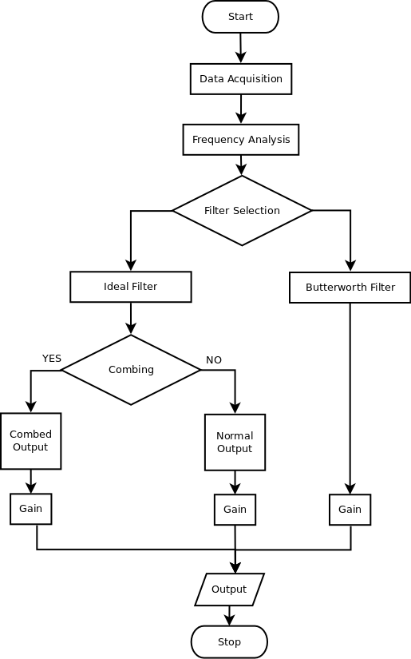

## PiPyDenoiser
Python module which denoises audio signals for the RaspberryPi. Effectively, it reduces background noise using conventional filtering techniques.

## Places to be used
Audio Input to the Raspberry Pi, or in clips with low SNR and high amplitude low frequency noise.

## Key Features
* Audio parameter getter
* Amplifying audio signals
* Ideal Filtering at software level
* Adding option parsing to enable better software engineering
* Butterworth bandpass filter to reduce background noise
* Artificial Combing to reduce high power harmonics

## Process Flow


## Tool Usage
* To find out how to use the tool, use
  ```$ ./proc.py -h ``` for help instructions

* Additionally, to provide an input file, 
  ```$ ./proc.py -i inp_file.wav```
  [Currently, the tool supports only wav formats].


## Brief Description
* Human voice signals have a frequency range of 300 Hz to 3.4 kHz. To reduce the bandwidth further [to curtail the noise signals], we use a bandwidth of about 5 Hz to 2000 Hz. 
* There are options to use an ideal filter, butterworth and artificial combing.
  * Ideal Filter: To analyse the frequency response, and objectively keep/remove certain frequency components.
  * Butterworth filter: To implement a practical realization of the above ideal filter.
  * Artificial Combing: It was observed that the noise signal had several high power harmonics in the low frequency range even after applying the ideal filter. Thus, to eliminate them, a naive thresholding was applied, which enabled our signal to get enhanced.
